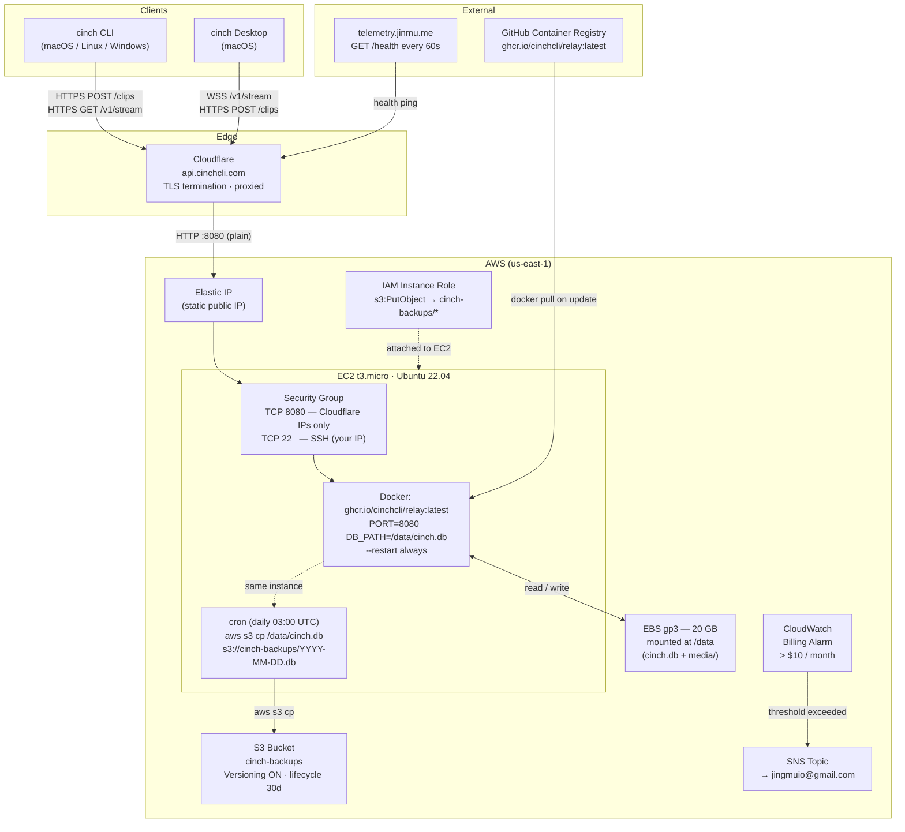

# Cinch Relay — AWS Infrastructure

## Component notes

| Component | Detail |
|---|---|
| EC2 t3.micro | 2 vCPU / 1 GB RAM. Sufficient for personal + small-team load. |
| EBS gp3 20 GB | Mounted at `/data`. Holds `cinch.db` (SQLite) and `media/` (binary clips). Resize with `resize2fs` if needed, no downtime. |
| Elastic IP | Static IP attached to the instance so the Cloudflare A-record doesn't break on stop/start. |
| Cloudflare | DNS-proxied A record → Elastic IP. SSL mode **Full** (Cloudflare ↔ origin is plain HTTP on :8080). Firewall rule: block requests missing `CF-Connecting-IP` to hide origin IP. |
| Security Group | Inbound: TCP 8080 from [Cloudflare IP ranges](https://www.cloudflare.com/ips/), TCP 22 from your IP. Outbound: all (for docker pull, S3 backup, OAuth calls). |
| IAM Instance Role | Attached at launch. Policy: `s3:PutObject` on `arn:aws:s3:::cinch-backups/*`. No access keys needed on the instance. |
| S3 cinch-backups | Versioning ON for accidental-delete protection. Lifecycle rule: expire non-current versions after 30 days. |
| CloudWatch Billing Alarm | Metric: `EstimatedCharges`, threshold `$10`, period 1 day. SNS → email. |
| cron daily backup | `/etc/cron.d/cinch-backup`: `0 3 * * * root aws s3 cp /data/cinch.db s3://cinch-backups/$(date +\%F).db` |

## Monthly cost estimate (us-east-1, on-demand)

| Resource | Cost |
|---|---|
| EC2 t3.micro | ~$8.47 |
| EBS gp3 20 GB | ~$1.60 |
| Elastic IP (attached) | $0.00 |
| S3 (< 1 GB backups) | < $0.03 |
| Data transfer out (< 1 GB) | < $0.10 |
| **Total** | **~$10.20 / month** |
